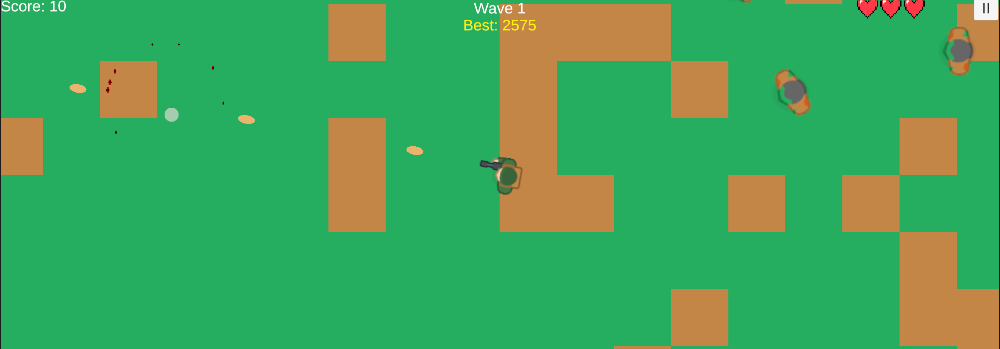
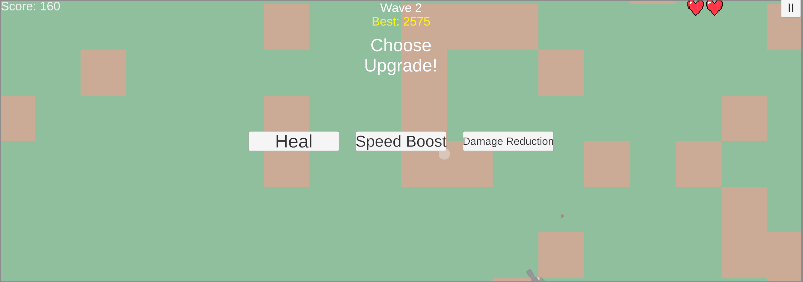
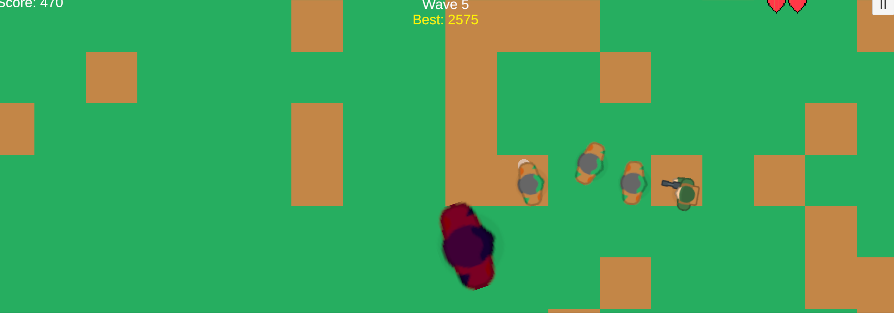
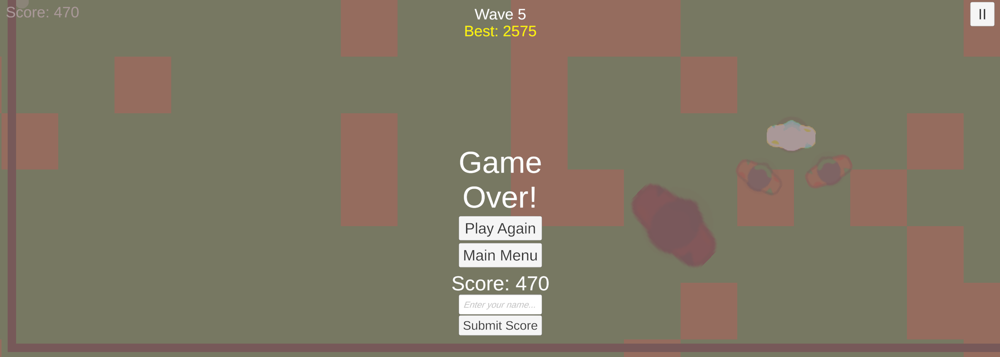

# 🧟 Swarm

A fast-paced top-down zombie survival shooter built with Unity.
Play it now on [itch.io](https://yaakovamoyal.itch.io/swarm)!

---

## 🎮 Gameplay

Survive endless waves of zombies, collect upgrades, and defeat bosses!

- **Move** – WASD / Arrow Keys (PC) | Virtual Joystick (Mobile)
- **Aim & Shoot** – Mouse (PC) | Touch screen (Mobile)
- **Pause** – ESC or Pause button

---

## 📸 Screenshots

### Main Menu

### Gameplay

### Upgrades

### Boss Wave

### Game Over

---

## ⚙️ Features

- 🌊 Endless wave system with increasing difficulty
- 👾 3 enemy types – Fast, Tank, and regular Zombies
- 💀 Boss every 5 waves with scaling health
- 🔫 Upgrade system – Rapid Fire, Double Shot, Triple Shot, Explosive Bullets
- 🗺️ Randomly generated map every game
- 🏆 Global leaderboard powered by LootLocker
- 🎵 Background music with volume control
- 📱 Mobile & PC support

---

## 🛠️ Built With

- **Unity 6**
- **C#**
- **LootLocker SDK** – Global leaderboard
- **Kenney.nl** – Assets

---

## 🚀 Play Now

👉 [Play on itch.io](https://yaakovamoyal.itch.io/swarm)

---

## 👨‍💻 Developer

Made by **Yaakov Amoyal**
[GitHub](https://github.com/yaakovamoyal) | [itch.io](https://yaakovamoyal.itch.io)
